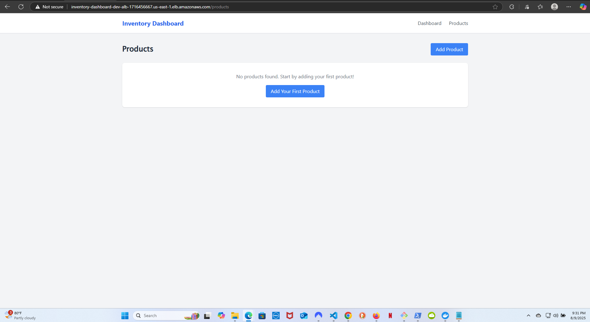
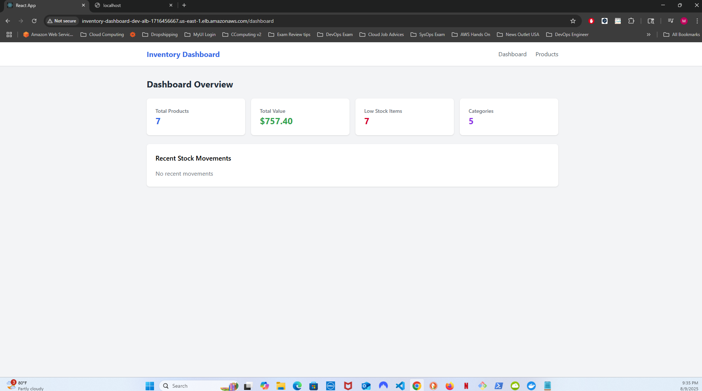
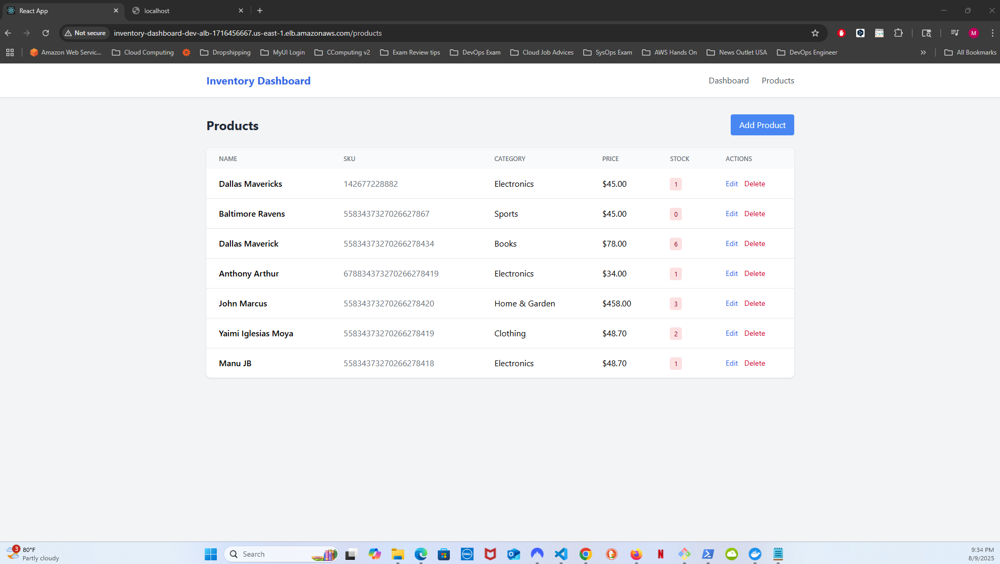
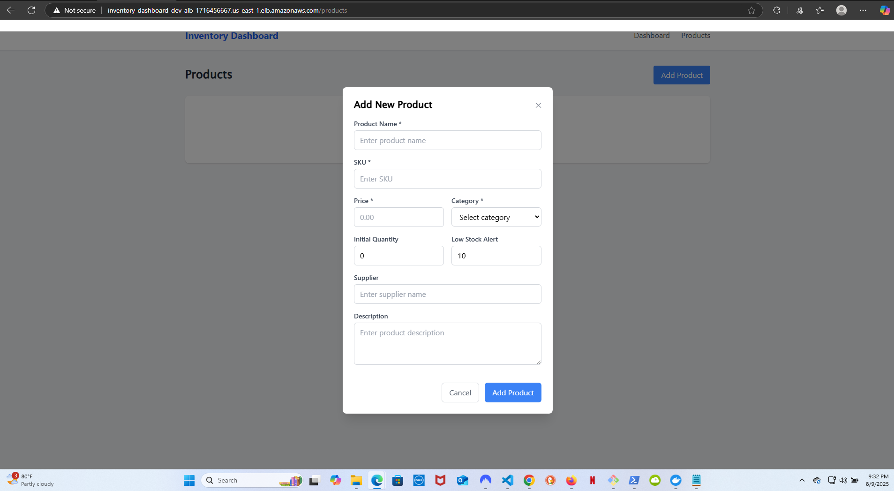

# Inventory Management Dashboard


> A complete, production-ready inventory management system showcasing modern cloud-native development practices.

## 🚀 Demo & Screenshots

<table>
<tr>
<td width="50%">
<h3>🏠 Landing Page</h3>

<p><em>Clean, professional welcome page with call-to-action</em></p>
</td>
<td width="50%">
<h3>📊 Real-time Dashboard</h3>

<p><em>Interactive dashboard with live statistics and metrics</em></p>
</td>
</tr>
<tr>
<td width="50%">
<h3>📦 Product Management</h3>

<p><em>Complete product management with modal forms</em></p>
</td>
<td width="50%">
<h3>➕ Add Product Modal</h3>

<p><em>Professional form interface for adding products</em></p>
</td>
</tr>
</table>

## 🏠 Local Development

Get started in minutes with Docker Compose:

```bash
# Clone repository
git clone https://github.com/ManuJB023/inventory-dashboard.git
cd inventory-dashboard

# Copy example configurations
cp backend/.env.example backend/.env
cp frontend/.env.example frontend/.env

# Start with Docker Compose
docker-compose up -d
```

**🎯 Access your local application:**
- **Frontend**: http://localhost:3000
- **Backend API**: http://localhost:3001/api
- **Database**: localhost:5432 (PostgreSQL)
- **Health Check**: http://localhost:3001/health

## 🏗️ Architecture Overview

```
┌─────────────────┐    ┌─────────────────┐    ┌─────────────────┐
│   React App     │    │   Node.js API   │    │   PostgreSQL    │
│   (Frontend)    │◄───┤   (Backend)     │◄───┤   (Database)    │
│   Port: 3000    │    │   Port: 3001    │    │   Port: 5432    │
└─────────────────┘    └─────────────────┘    └─────────────────┘
         │                       │                       │
         └───────────────────────┼───────────────────────┘
                                 │
                    ┌─────────────────┐
                    │ Docker Compose  │
                    │ (Local Dev)     │
                    │       OR        │
                    │   AWS ECS       │
                    │ (Production)    │
                    └─────────────────┘
```

## 🎉 Features

### ✨ Frontend (React + TypeScript)
- **🏠 Landing Page** - Professional welcome page with navigation
- **📊 Real-time Dashboard** - Live statistics and analytics
- **📦 Product Management** - Complete CRUD operations with modal forms
- **🔍 Search & Filtering** - Advanced product filtering and pagination
- **📱 Responsive Design** - Works perfectly on all devices
- **🎯 React Router** - Smooth single-page application navigation
- **🎨 Tailwind CSS** - Modern, professional UI with animations

### 🛡️ Backend (Node.js + Express)
- **🔒 RESTful API** - Comprehensive endpoints with validation
- **🛡️ Security Features** - Helmet, CORS, rate limiting, input validation
- **📝 Request Logging** - Complete audit trail with Morgan
- **🔍 Advanced Queries** - Pagination, search, filtering, sorting
- **📊 Analytics Engine** - Real-time dashboard statistics
- **🏥 Health Monitoring** - Health check endpoints
- **💾 Database ORM** - Sequelize with PostgreSQL
- **🔄 Stock Tracking** - Complete inventory movement history

### 🚀 Infrastructure (Production-Ready)
- **🐳 Docker Containers** - Multi-stage builds for optimization
- **☁️ AWS ECS Fargate** - Serverless container orchestration
- **🗄️ RDS PostgreSQL** - Managed database with backups
- **🔄 Load Balancer** - Application Load Balancer with health checks
- **🌐 VPC Network** - Secure networking with public/private subnets
- **📊 CloudWatch** - Centralized logging and monitoring
- **🔐 Security** - IAM roles, security groups, encrypted secrets
- **⚡ Auto Scaling** - CPU-based scaling policies

## 📋 Quick Start Guide

### Prerequisites
- **Node.js** 18+ and npm
- **Docker** and Docker Compose
- **Git** for version control

### 1. Clone and Setup
```bash
git clone https://github.com/ManuJB023/inventory-dashboard.git
cd inventory-dashboard

# Install dependencies (optional - Docker handles this)
cd backend && npm install
cd ../frontend && npm install
cd ..
```

### 2. Local Development
```bash
# Copy environment configurations
cp backend/.env.example backend/.env
cp frontend/.env.example frontend/.env

# Edit .env files with your preferences (optional for local dev)
# Default values work out of the box

# Start all services
docker-compose up -d

# View logs (optional)
docker-compose logs -f
```

### 3. Access Application
- **Frontend**: http://localhost:3000
- **Backend API**: http://localhost:3001
- **API Documentation**: http://localhost:3001/api/products
- **Health Check**: http://localhost:3001/health

### 4. Test the Features
1. **Visit Frontend** → Professional landing page
2. **Click "Get Started"** → Navigate to dashboard
3. **View Dashboard** → See real-time statistics (initially empty)
4. **Go to Products** → Product management interface
5. **Add Products** → Use the modal form to add inventory items
6. **Watch Dashboard Update** → See live statistics change

## 📁 Project Structure

```
inventory-dashboard/
├── 📁 backend/                 # Node.js API Server
│   ├── 📄 app.js              # Main application file
│   ├── 📄 package.json        # Dependencies and scripts
│   ├── 📄 Dockerfile          # Container configuration
│   └── 📄 .env.example        # Environment template
├── 📁 frontend/               # React Application
│   ├── 📁 src/
│   │   ├── 📄 App.tsx         # Main React component
│   │   ├── 📄 index.tsx       # Application entry point
│   │   └── 📄 index.css       # Tailwind CSS styles
│   ├── 📁 public/             # Static assets
│   ├── 📄 package.json        # React dependencies
│   ├── 📄 Dockerfile          # Multi-stage build
│   └── 📄 nginx.conf          # Production web server
├── 📁 terraform/              # Infrastructure as Code
│   ├── 📄 main.tf             # VPC, networking, RDS
│   ├── 📄 ecs.tf              # ECS cluster and services
│   ├── 📄 variables.tf        # Input variables
│   ├── 📄 outputs.tf          # Output values
│   └── 📄 terraform.tfvars.example # Configuration template
├── 📄 docker-compose.yml      # Local development
├── 📄 .gitignore             # Git ignore rules
└── 📄 README.md              # This documentation
```

## 🚀 Deploy to AWS (Optional)

Deploy to production-ready AWS infrastructure:

### Prerequisites for AWS Deployment
- **AWS CLI** configured with appropriate permissions
- **Terraform** 1.6+ installed
- **Docker** for building images

### 1. Configure AWS
```bash
# Configure AWS credentials
aws configure

# Verify access
aws sts get-caller-identity
```

### 2. Setup Terraform
```bash
# Copy and edit Terraform configuration
cp terraform/terraform.tfvars.example terraform/terraform.tfvars

# Edit terraform.tfvars with your values:
# - aws_region (e.g., us-east-1)
# - environment (dev/staging/prod)
# - db_password (secure password)
# - resource sizing
```

### 3. Deploy Infrastructure
```bash
cd terraform

# Initialize Terraform
terraform init

# Plan deployment
terraform plan

# Deploy (takes 10-15 minutes)
terraform apply
```

### 4. Build and Deploy Applications
```bash
# Get your AWS account ID
ACCOUNT_ID=$(aws sts get-caller-identity --query Account --output text)
REGION=us-east-1

# Login to ECR
aws ecr get-login-password --region $REGION | docker login --username AWS --password-stdin $ACCOUNT_ID.dkr.ecr.$REGION.amazonaws.com

# Build and push backend
cd backend
docker build -t inventory-dashboard-dev-backend .
docker tag inventory-dashboard-dev-backend:latest $ACCOUNT_ID.dkr.ecr.$REGION.amazonaws.com/inventory-dashboard-dev-backend:latest
docker push $ACCOUNT_ID.dkr.ecr.$REGION.amazonaws.com/inventory-dashboard-dev-backend:latest

# Build and push frontend
cd ../frontend
docker build -t inventory-dashboard-dev-frontend .
docker tag inventory-dashboard-dev-frontend:latest $ACCOUNT_ID.dkr.ecr.$REGION.amazonaws.com/inventory-dashboard-dev-frontend:latest
docker push $ACCOUNT_ID.dkr.ecr.$REGION.amazonaws.com/inventory-dashboard-dev-frontend:latest

# Update ECS services
aws ecs update-service --cluster inventory-dashboard-dev-cluster --service inventory-dashboard-dev-backend --force-new-deployment
aws ecs update-service --cluster inventory-dashboard-dev-cluster --service inventory-dashboard-dev-frontend --force-new-deployment
```

### 5. Access Your Deployment
```bash
# Get the load balancer URL
terraform output application_url

# Test the deployment
curl $(terraform output -raw application_url)/health
```

## 📊 API Reference

### Products API
| Method | Endpoint | Description |
|--------|----------|-------------|
| `GET` | `/api/products` | List all products with pagination |
| `GET` | `/api/products/:id` | Get single product details |
| `POST` | `/api/products` | Create new product |
| `PUT` | `/api/products/:id` | Update existing product |
| `DELETE` | `/api/products/:id` | Delete product |

### Dashboard API
| Method | Endpoint | Description |
|--------|----------|-------------|
| `GET` | `/api/dashboard/stats` | Get dashboard statistics |
| `GET` | `/api/categories` | Get product categories |

### Stock Management API
| Method | Endpoint | Description |
|--------|----------|-------------|
| `POST` | `/api/stock-movements` | Record stock movement |
| `GET` | `/api/stock-movements` | Get movement history |

### System API
| Method | Endpoint | Description |
|--------|----------|-------------|
| `GET` | `/health` | Health check with database status |

## 🔧 Configuration

### Backend Environment Variables
```bash
# Copy from backend/.env.example
NODE_ENV=development
PORT=3001
DB_HOST=localhost
DB_PORT=5432
DB_NAME=inventory_db
DB_USER=postgres
DB_PASSWORD=your_secure_password
JWT_SECRET=your_jwt_secret_minimum_32_characters
CORS_ORIGIN=http://localhost:3000
```

### Frontend Environment Variables
```bash
# Copy from frontend/.env.example
REACT_APP_API_URL=http://localhost:3001/api
REACT_APP_ENV=development
REACT_APP_ENABLE_ANALYTICS=false
```

## 🧪 Development & Testing

### Local Development Commands
```bash
# Start all services
docker-compose up -d

# View logs
docker-compose logs -f backend
docker-compose logs -f frontend

# Stop services
docker-compose down

# Rebuild after code changes
docker-compose up --build

# Run tests (when implemented)
cd backend && npm test
cd frontend && npm test
```

### Database Management
```bash
# Access PostgreSQL directly
docker-compose exec postgres psql -U postgres -d inventory_db

# View database logs
docker-compose logs postgres

# Reset database (removes all data)
docker-compose down -v
docker-compose up -d
```

## 🛡️ Security Features

### Application Security
- **Input Validation** - Express-validator on all endpoints
- **SQL Injection Prevention** - Sequelize ORM parameterized queries
- **XSS Protection** - Helmet.js security headers
- **CORS Configuration** - Controlled cross-origin requests
- **Rate Limiting** - Protection against abuse
- **Request Logging** - Complete audit trail

### Infrastructure Security (AWS)
- **VPC Isolation** - Private subnets for applications
- **Security Groups** - Network-level access control
- **IAM Roles** - Least privilege access
- **Secrets Management** - AWS Systems Manager
- **Encryption** - Data encrypted in transit and at rest

## 💰 AWS Cost Estimation

### Development Environment
- **ECS Fargate**: ~$30-50/month (2 tasks)
- **RDS t3.micro**: ~$15-20/month
- **Application Load Balancer**: ~$20/month
- **NAT Gateway**: ~$45/month (HA setup)
- **CloudWatch & Storage**: ~$5-10/month

**Total: ~$115-145/month**

### Cost Optimization
- Use single NAT Gateway for development (-$22/month)
- Use RDS t3.micro free tier (first 12 months)
- Set CloudWatch log retention policies
- Use Spot instances for non-critical workloads

## 🚀 Performance & Scalability

### Local Development
- **Frontend**: Instant hot reload
- **Backend**: Nodemon auto-restart
- **Database**: Local PostgreSQL instance

### Production (AWS)
- **Auto-scaling**: CPU-based scaling policies
- **Load Balancing**: Multi-AZ distribution
- **Database**: RDS with automated backups
- **Monitoring**: CloudWatch metrics and alarms

## 🔮 Roadmap & Future Enhancements

### Phase 1 - Core Features ✅
- [x] Product management CRUD
- [x] Real-time dashboard
- [x] Responsive design
- [x] Docker containerization
- [x] AWS deployment

### Phase 2 - Enhanced Features
- [ ] User authentication and authorization
- [ ] Advanced inventory reports
- [ ] Product image uploads
- [ ] Barcode scanning support
- [ ] Email notifications for low stock

### Phase 3 - Enterprise Features
- [ ] Multi-tenant support
- [ ] Role-based access control
- [ ] API rate limiting and keys
- [ ] Advanced analytics with charts
- [ ] Integration with external systems

### Phase 4 - Mobile & Advanced
- [ ] React Native mobile app
- [ ] Real-time notifications
- [ ] Machine learning for demand forecasting
- [ ] Multi-warehouse support
- [ ] Advanced reporting dashboard

## 🤝 Contributing

We welcome contributions! Please see [CONTRIBUTING.md](CONTRIBUTING.md) for guidelines.

### Quick Contribution Steps
1. **Fork the repository**
2. **Create feature branch** (`git checkout -b feature/amazing-feature`)
3. **Make changes and test locally**
4. **Commit changes** (`git commit -m 'Add amazing feature'`)
5. **Push to branch** (`git push origin feature/amazing-feature`)
6. **Open Pull Request**

### Development Setup for Contributors
```bash
git clone https://github.com/YOUR-USERNAME/inventory-dashboard.git
cd inventory-dashboard
cp backend/.env.example backend/.env
cp frontend/.env.example frontend/.env
docker-compose up -d
```

## 🐛 Troubleshooting

### Common Issues

#### "Cannot connect to database"
```bash
# Check if PostgreSQL is running
docker-compose ps postgres

# View database logs
docker-compose logs postgres

# Restart database
docker-compose restart postgres
```

#### "Frontend not loading"
```bash
# Check if frontend is running
docker-compose ps frontend

# Rebuild frontend
docker-compose up --build frontend

# Check frontend logs
docker-compose logs frontend
```

#### "API endpoints not working"
```bash
# Check backend status
curl http://localhost:3001/health

# View backend logs
docker-compose logs backend

# Restart backend
docker-compose restart backend
```

### AWS Deployment Issues
```bash
# Check ECS service status
aws ecs describe-services --cluster inventory-dashboard-dev-cluster --services inventory-dashboard-dev-backend

# View CloudWatch logs
aws logs tail /ecs/inventory-dashboard-dev-backend --follow

# Check RDS status
aws rds describe-db-instances --db-instance-identifier inventory-dashboard-dev-postgres
```

## 📚 Learning Resources

### Technologies Used
- **[React Documentation](https://react.dev/)** - Frontend framework
- **[Node.js Documentation](https://nodejs.org/docs/)** - Backend runtime
- **[Express.js Guide](https://expressjs.com/)** - Web framework
- **[PostgreSQL Documentation](https://www.postgresql.org/docs/)** - Database
- **[Docker Documentation](https://docs.docker.com/)** - Containerization
- **[AWS ECS Documentation](https://docs.aws.amazon.com/ecs/)** - Container orchestration
- **[Terraform AWS Provider](https://registry.terraform.io/providers/hashicorp/aws/)** - Infrastructure

### Related Projects
- **[React Inventory Management](https://github.com/topics/inventory-management)** - Similar projects
- **[AWS ECS Examples](https://github.com/topics/aws-ecs)** - ECS deployment patterns
- **[Full Stack JavaScript](https://github.com/topics/full-stack)** - Full-stack applications

## 📄 License

This project is licensed under the MIT License - see the [LICENSE](LICENSE) file for details.

## 🏆 Acknowledgments

**Built with modern technologies:**
- **Frontend**: React 19, TypeScript 5, Tailwind CSS
- **Backend**: Node.js 18, Express, Sequelize ORM
- **Database**: PostgreSQL 16
- **Infrastructure**: AWS ECS Fargate, Terraform
- **DevOps**: Docker, CloudWatch

**Inspired by modern cloud-native applications and best practices in:**
- Full-stack JavaScript development
- Containerized application deployment
- Infrastructure as Code
- Security-first development
- Professional documentation

## 📞 Support

- **🐛 Issues**: [GitHub Issues](https://github.com/ManuJB023/inventory-dashboard/issues)
- **💬 Discussions**: [GitHub Discussions](https://github.com/ManuJB023/inventory-dashboard/discussions)
- **📖 Documentation**: This README and inline code comments
- **🔍 Examples**: Check the `/examples` directory for usage patterns

---

**⭐ Star this repository if you find it helpful!**

**🔗 Connect**: [GitHub Profile](https://github.com/ManuJB023) | [LinkedIn](https://linkedin.com/in/your-profile)

**📊 Project Stats**:   

---

*Last updated: August 9, 2025 | Version: 1.0.0*